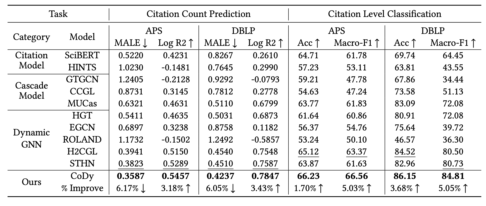

# CoDy: Modeling Scholarly Collaboration and Temporal Dynamics in Citation Networks for Impact Prediction

<a href='https://dl.acm.org/doi/10.1145/3626772.3657926'>

Environment
---
For pip: 
 
`pip install -r requirements.txt`

Data Processing
---
The core process is to build the labels from academic graphs, including the future citations (like, in 5 years) and the colabration among authors. Refer to the `data_process` part for the details.

Framework
---
 

Peformances
---
Performances on Impact Prediction Task. The best and second-best performances are indicated in bold and italicized, respectively. The bottom line indicates the percentage improvement of our model compared to the second-best one. ↑: larger value, better performance. ↓: smaller value, better performance.

